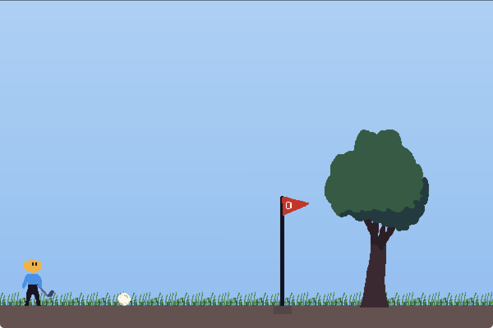
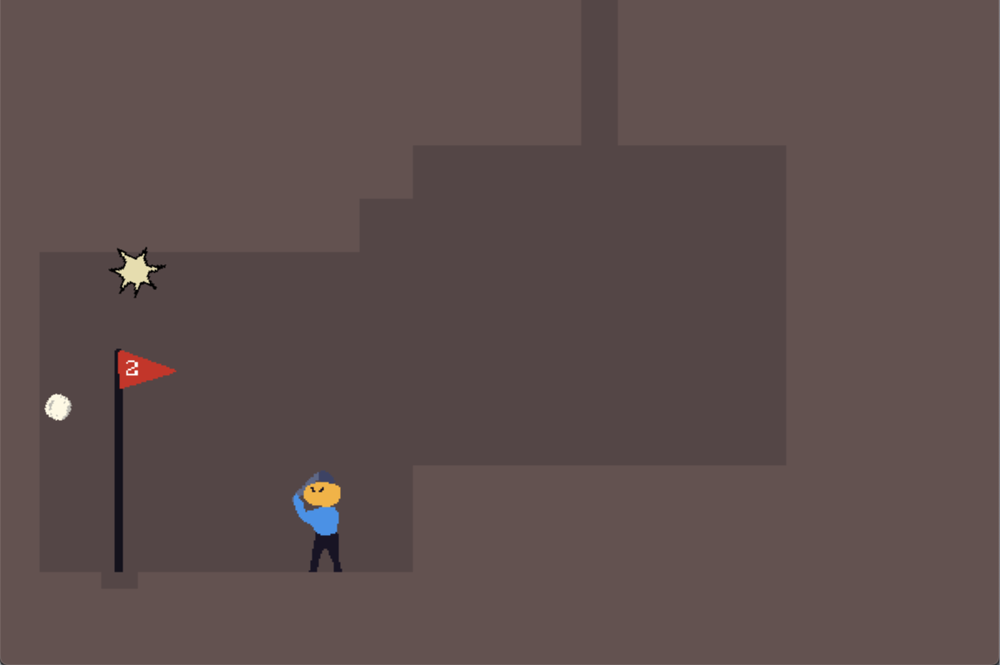
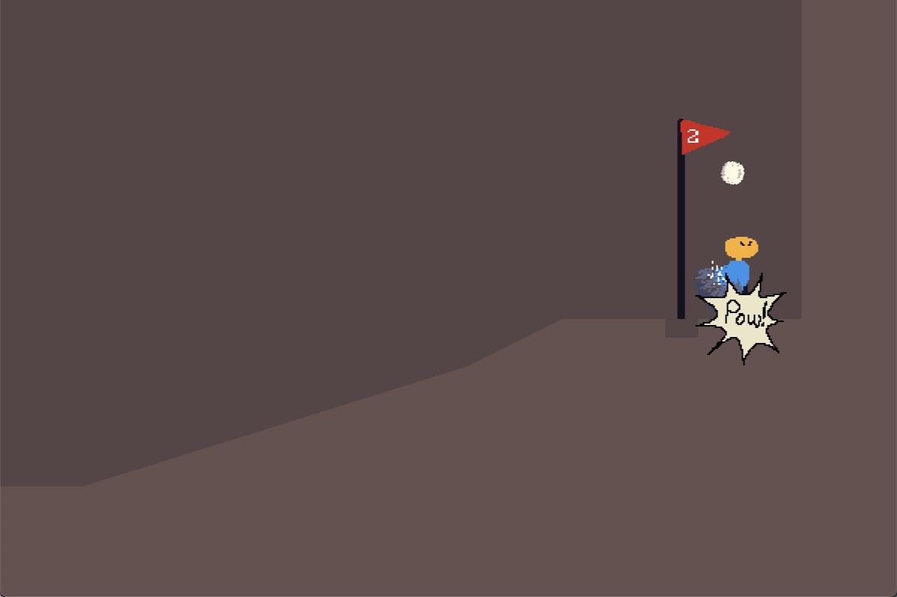
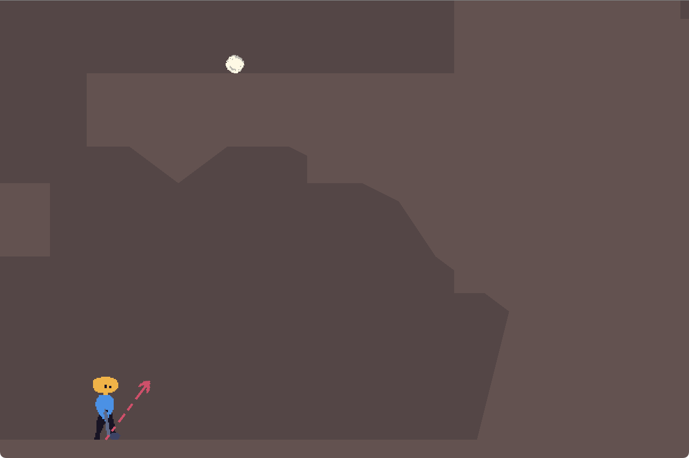
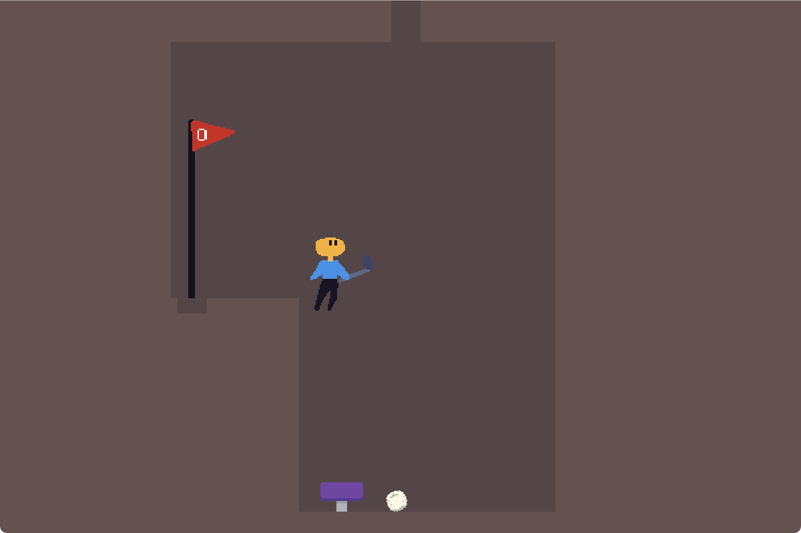

# Down Golf 🏌️‍♂️⛳

A unique 2D platforming and golfing game created for Ludum Dare 57 game jam with the theme "depths".

## About the Game

Down Golf combines platforming mechanics with golf gameplay. You must navigate through 2D platforming levels while also getting your golf ball to the hole. The twist? Each new level takes you deeper below the previous one, creating an ever-descending challenge.

## Controls

- **Move**: Left/Right arrow keys or A/D
- **Jump**: Up arrow key or W
- **Shoot the ball**: Space
- **Menu**: Escape

## Screenshots

## Tools

- [Godot](https://godotengine.org/) game engine
- [Aseprite](https://www.aseprite.org/) for graphics
- My own sound effects

## Links

- Play online at [Itch.io](https://martindzejky.itch.io/down-golf)
- Download from [releases](https://github.com/martindzejky/down-golf/releases)
- [Submission page](https://ldjam.com/events/ludum-dare/57/down-golf)

## Known Issues

- Sometimes the ball can get stuck inside a wall, especially when it bounces on a trampoline. I tried fixing this but failed. I don't understand why it is happening, the ball is just [Godot's RigidBody2D](https://docs.godotengine.org/en/stable/classes/class_rigidbody2d.html) and I also enabled continuous collision detection, [as you can see here](https://github.com/martindzejky/down-golf/blob/47753e0a11c94c9a382d839a20c59ad34e859432/objects/ball.tscn#L40).

## Improvement Ideas

- Right now the camera tries to follow all 3 at the same time - the player, the ball, and the current ball. It should rather be smarter. Follow only the player, then when a ball is close, follow both. It should also move to the pole when it is hit. ⛳️
- Some sort of a tutorial on the surface. I'm thinking to start the player next to the ball, prevent movement, and just show how to shoot. If they shoot over the tree, just spawn a new ball. Then, when they hit the first pole and the tunnel opens, highlight it somehow to teach the player that the game is about going deeper.
- Camera shake when hitting the ball.
- More game mechanics for the levels. I was thinking about some which are useful for both platforming and the ball physics, like moving platforms, fans that move the ball, push buttons which can only be triggered by the ball...
- Better, much better score tracking system and how it is presented. Give it some more meaning rather than just tracking the amount of hits per level.
- Allow to restart a single level, rather than the whole game.
