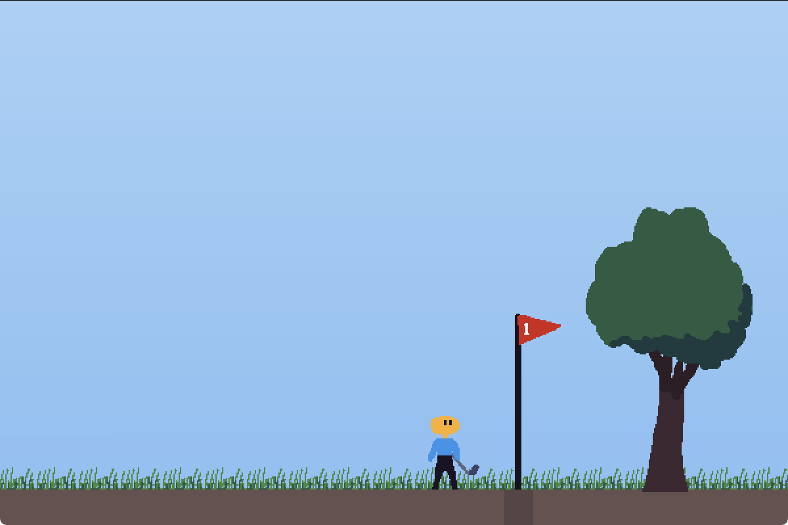

# Down Golf 🏌️‍♂️⛳

A unique 2D platforming and golfing game created for Ludum Dare 57 game jam with the theme "depths".

## About the Game

Down Golf combines platforming mechanics with golf gameplay. You must navigate through 2D platforming levels while also getting your golf ball to the hole. The twist? Each new level takes you deeper below the previous one, creating an ever-descending challenge.

## Controls

- **Move**: Left/Right arrow keys or A/D
- **Jump**: Up arrow key or W
- **Shoot the ball**: Space
- **Menu**: Escape

## Screenshots

## Tools

- [Godot](https://godotengine.org/) game engine
- [Aseprite](https://www.aseprite.org/) for graphics
- My own sound effects

## Links

- Play online at [Itch.io](https://martindzejky.itch.io/down-golf)
- Download from [releases](https://github.com/martindzejky/down-golf/releases)
- [Submission page](https://ldjam.com/events/ludum-dare/57/down-golf)
